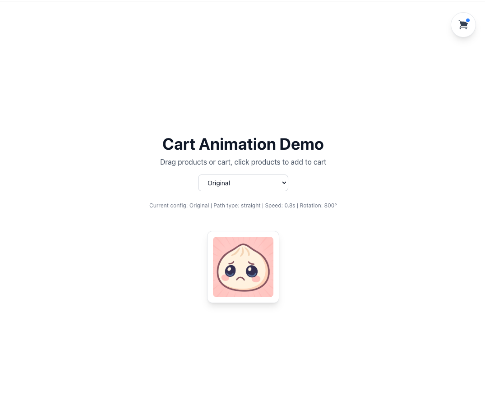

# Cart Animation Demo Project

An interactive cart animation demo project built with Next.js and Framer Motion. Showcases various animation effects when adding products to cart, supports dragging products and cart, and provides multiple animation configuration options.



## ✨ Features

- 🎨 **Multiple Animation Configs**: Provides 9 different animation styles (Original, Fast, Smooth, Bouncy, Elegant, Spiral, Elastic, Magical, Minimal)
- 🖱️ **Drag Functionality**: Supports dragging product images and cart button
- 🎭 **Rich Animation Effects**:
  - Multiple path types (straight, parabola, spiral, elastic)
  - Customizable rotation angles
  - Scale and fade effects
  - Blur effects
  - Elastic easing functions
- 📱 **Responsive Design**: Adapts to various screen sizes
- ⚡ **High Performance Animations**: Uses Framer Motion for smooth animation effects
- 🎯 **TypeScript Support**: Complete type definitions for better development experience

## 🛠️ Tech Stack

- **Framework**: Next.js 16.0.1
- **UI Library**: React 19.2.0
- **Animation Library**: Framer Motion ^11
- **Styling**: Tailwind CSS ^4
- **Language**: TypeScript ^5
- **Package Manager**: Bun

## 📦 Installation

### Prerequisites

- [Bun](https://bun.sh/) (recommended to use the latest version)

### Installation Steps

1. Clone the project to local:

```bash
git clone <repository-url>
cd add-item-to-cart-animation
```

2. Install dependencies:

```bash
bun install
```

## 🚀 Running the Project

### Development Mode

```bash
bun dev
```

Open your browser and visit [http://localhost:3000](http://localhost:3000) to view the project.

### Build Production Version

```bash
bun run build
bun run start
```

### Code Linting

```bash
bun run lint
```

## 🎮 Usage

1. **Select Animation Config**: Use the dropdown menu at the top of the page to select different animation configurations
2. **Drag Products**: Click and drag product images to any position
3. **Drag Cart**: Click and drag the cart button to any position
4. **Add to Cart**: Click on product images, products will fly to the cart with animation effects

## 📁 Project Structure

```
add-item-to-cart-animation/
├── app/                      # Next.js App Router directory
│   ├── page.tsx             # Main page component
│   ├── layout.tsx           # Root layout component
│   └── globals.css          # Global styles
├── components/              # React components
│   ├── animation-config-selector.tsx  # Animation config selector
│   ├── cart-button.tsx      # Cart button component
│   ├── cart-icon.tsx        # Cart icon component
│   ├── cart-item-animation.tsx  # Cart animation component
│   └── product-container.tsx    # Product container component
├── config/                  # Configuration files
│   └── animation-config.ts  # Animation configuration definitions
├── hooks/                   # Custom Hooks
│   ├── use-cart-animation.ts  # Cart animation Hook
│   └── use-drag.ts          # Drag functionality Hook
├── types/                   # TypeScript type definitions
│   └── index.ts
├── utils/                   # Utility functions
│   └── animation-helpers.ts # Animation helper functions
└── public/                  # Static resources
    └── item.jpg            # Product image
```

## 🎨 Animation Configuration Guide

The project provides 9 preset animation configurations, each containing the following parameters:

- **speed**: Animation duration (seconds), recommended 0.3-1.5
- **delay**: Delay time (seconds), recommended 0-0.3
- **xEasing / yEasing / scaleEasing**: cubic-bezier easing curves
- **pathType**: Path type (`straight` | `parabola` | `spiral` | `elastic`)
- **pathHeight**: Path height (pixels), recommended 50-300
- **rotation**: Rotation angle (degrees), 0-360
- **blur**: Blur effect intensity, 0-20
- **scale**: Whether to enable scale effect
- **fade**: Whether to enable fade out effect
- **spiralTurns**: Number of spiral turns (only for spiral path)

### Preset Configuration List

| Config Name | Display Name | Features |
|------------|-------------|----------|
| original | Original | Classic rotation animation effect |
| fast | Fast | Quick and concise animation |
| smooth | Smooth | Smooth and fluid animation with fade effect |
| bouncy | Bouncy | Parabola path with bounce effect |
| elegant | Elegant | Elegant parabola animation |
| spiral | Spiral | Spiral path animation |
| elastic | Elastic | Elastic easing effect |
| magical | Magical | Multi-turn spiral, magical effect |
| minimal | Minimal | Minimalist style, no rotation |

## 🔧 Custom Animation Configuration

You can add or modify animation configurations in `config/animation-config.ts`:

```typescript
export const animationConfigs = {
  // Add your configuration
  custom: {
    speed: 1.0,
    delay: 0.1,
    xEasing: [0.42, 0, 0.58, 1] as CubicBezierEasing,
    yEasing: [0.42, 0, 0.58, 1] as CubicBezierEasing,
    scaleEasing: [0.42, 0, 0.58, 1] as CubicBezierEasing,
    pathType: "parabola" as PathType,
    pathHeight: 150,
    rotation: 360,
    blur: 0,
    scale: true,
    fade: false,
  },
} as const;
```

Remember to add the corresponding display name in `configDisplayNames`.

## 🧩 Core Component Guide

### `useCartAnimation` Hook

Core logic for managing cart animations, responsible for:
- Calculating positions of products and cart
- Generating animation data
- Managing animation lifecycle

### `useDrag` Hook

Hook that implements drag functionality, provides:
- Position tracking
- Drag event handling

### `CartItemAnimation` Component

Component responsible for rendering a single animation item, uses Framer Motion to implement animation effects.

## 📝 Development Notes

- All components are written in TypeScript for type safety
- Follow React Hooks best practices
- Use Tailwind CSS for styling
- Animations are implemented using Framer Motion's `motion` components
- Follow Next.js App Router file structure conventions

## 🤝 Contributing

Issues and Pull Requests are welcome!

## 📄 License

This project is licensed under the MIT License. See the [LICENSE](./LICENSE) file for details.
